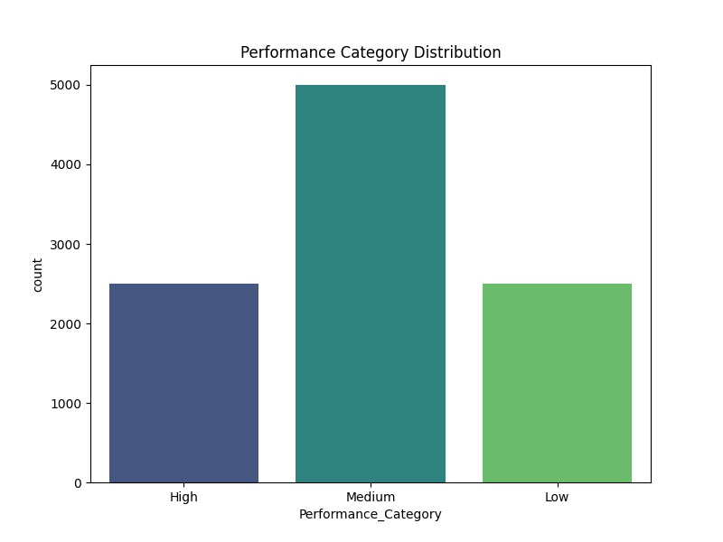
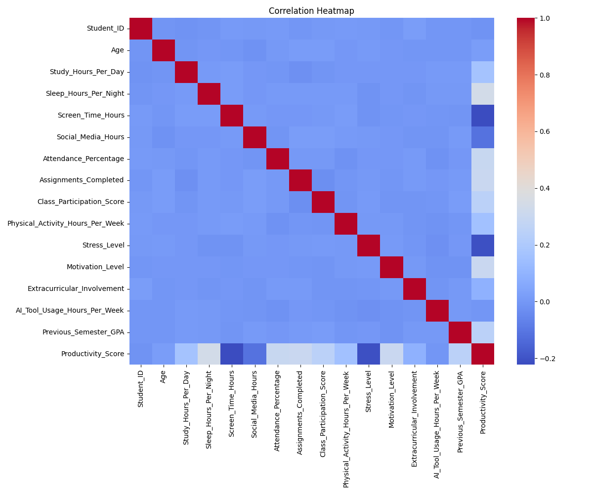

# Student Productivity Exploratory Data Analysis (EDA)

This project contains an Exploratory Data Analysis of the Student Productivity Dataset.

## Overview
The dataset contains **10,000 records** and **20 features**, capturing various dimensions of student life such as study hours, sleep habits, screen time, physical activity, and resulting productivity metrics.

## Key Findings

### 1. Missing Values
- The dataset is largely complete, with most columns missing about **1-2%** of their values.
- These could easily be imputed with mean/median for numerical features, or mode for categorical variables.

### 2. Performance Distribution
The dataset is perfectly balanced into three categories for the `Performance_Category` label:
- **Medium**: 5,000 (50%)
- **High**: 2,500 (25%)
- **Low**: 2,500 (25%)



### 3. Drivers of Productivity
We measured the correlation between the various features and the target variable, `Productivity_Score`.



**Positive Drivers (Things that improve productivity):**
- **Sleep Hours Per Night** (+0.34): The strongest positive correlation! A good night's rest directly impacts productivity.
- **Motivation Level** (+0.30): Highly motivated students tend to perform better.
- **Assignments Completed** (+0.30): Staying on top of assignments correlates strongly with overall productivity.
- **Attendance Percentage** (+0.29): Showing up to class is a consistent predictor of success.
- **Previous Semester GPA** (+0.25): Past performance is a solid indicator of future results.

**Negative Drivers (Things that hurt productivity):**
- **Screen Time Hours** (-0.22): Excessive general screen time is the largest detractor of productivity.
- **Stress Level** (-0.21): High stress correlates negatively with performance.
- **Social Media Hours** (-0.12): Shows a moderate negative impact on student focus and productivity.

**Negligible Impact:**
- **Age** (+0.02) and **AI Tool Usage Hours** (0.00): Surprisingly, the amount of time spent using AI tools doesn't seem to have any linear correlation with the Productivity Score in this dataset.

## Instructions
To reproduce the findings, you can open and execute the cells in `eda.ipynb`.

Ensure your environment is set up by installing the necessary dependencies:
```bash
pip install pandas seaborn matplotlib jupyter kagglehub
```
